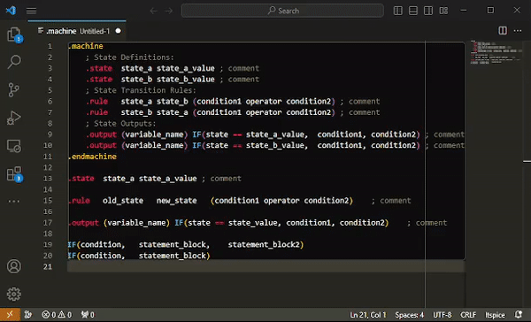

# LTSpice State Machines README

This extension offers textual Highlights of LTSpice State Machines
Also suggests common Snippets of the various State Machine elements

LTspice XVII includes an arbitrary state machine and introduces a new programming language called Contraption Programming Language. There are five commands:
```ltspice
   .mach[ine] [<tripdt>] ; tripdt is an optional temporal tolerance
   .state <name> <value>
   .rule <old state> <new state> <condition>
   .output (node) <expression>
   .endmach[ine] ; end of block
```

For more details on LTSpice, visit: https://ltwiki.org/LTspiceHelpXVII/LTspiceHelp/html/DotMachine.htm

Github repository:
https://github.com/TedKus/LTSpiceStateMachine




## Features

```ltspice
; type: .mach
.machine
    ; State Definitions:
    .state	state_a	state_a_value ; comment
    .state	state_b	state_b_value ; comment
    ; State Transition Rules:
    .rule	state_a	state_b	(condition1 operator condition2) ; comment
    .rule	state_b	state_a	(condition1 operator condition2) ; comment
    ; State Outputs:
    .output	(variable_name)	IF(state == state_a_value,	condition1,	condition2) ; comment
    .output	(variable_name)	IF(state == state_b_value,	condition1,	condition2) ; comment
.endmachine

; type: .state
.state	state_a	state_a_value ; comment

; type: .rule
.rule	start_state	finish_state 	(condition1 operator condition2)	; comment

; type: .output
.output	(variable_name)	IF(state == state_value, condition1, condition2) 	; comment

; type: .par
.param variable_name = value

```

## Requirements

None
## Extension Settings

None
## Known Issues

+ notation for continuation lines in .params are not recognized properly
## Release Notes

First time trying this!

### 0.0.1

Initial release of LTSpice State Machines

**Enjoy!**
## [0.0.2]

- Correct the Markdown and add animation

